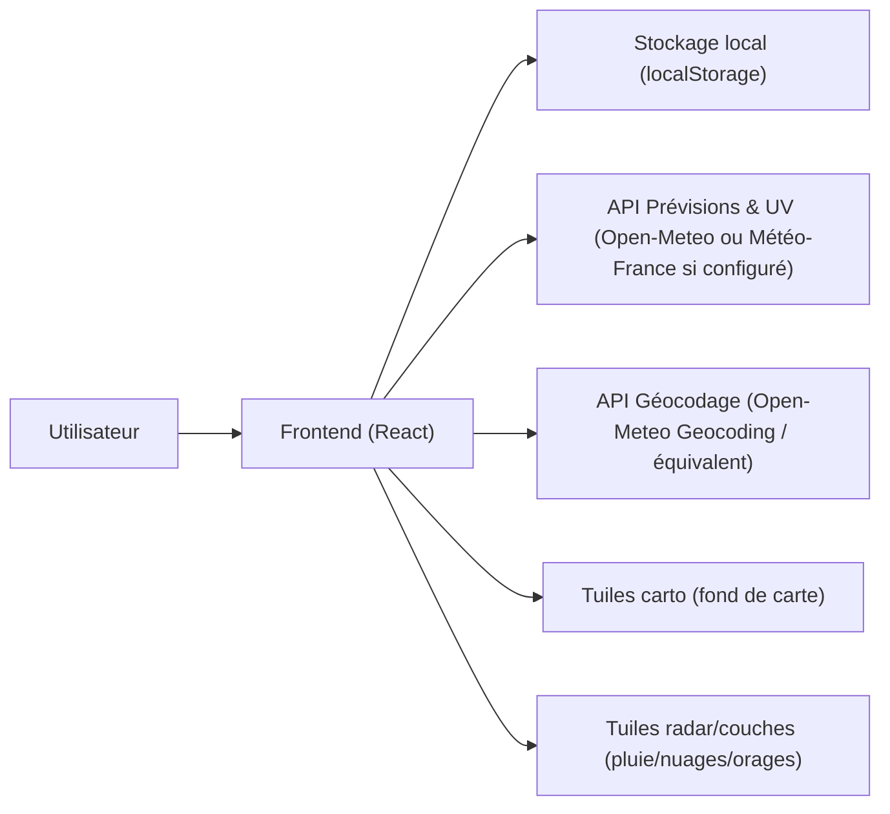
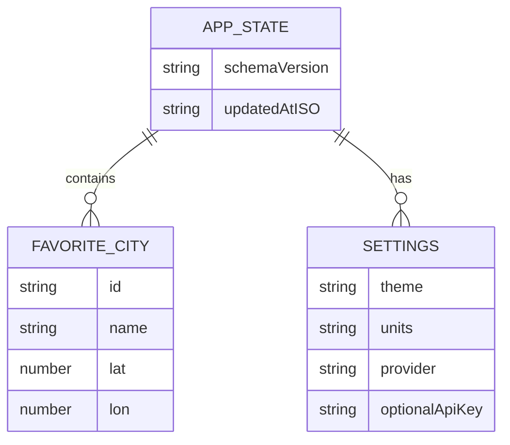

## 1. Conception d’architecture



Choix par défaut : architecture 100% frontend (pas de backend) pour rester simple et déployable gratuitement.

## 2. Description des technologies
- Frontend : React@18 + TypeScript + tailwindcss@3 + vite
- Cartographie : Leaflet (ou MapLibre GL si besoin de style avancé)
- Données météo (priorité gratuit) :
  - Option A (sans clé) : Open-Meteo (prévisions quotidiennes + UV si disponible) + Open-Meteo Geocoding
  - Option B (avec clé gratuite) : Portail API Météo-France (si l’utilisateur fournit un token)
- Couches carte (priorité gratuit) :
  - Pluie : tuiles radar précipitations (service gratuit type RainViewer)
  - Nuages / Orages : si indisponible gratuitement sans clé, activation via clé optionnelle (ex : tuiles OpenWeather) ou solution alternative gratuite compatible
- Persistance : localStorage (favoris, préférences, clé optionnelle)
- Déploiement : statique (Netlify / Vercel / GitHub Pages)

## 3. Définition des routes
| Route | Rôle |
|-------|------|
| / | Accueil : favoris + prévisions 7 jours |
| /carte | Carte radar avec filtres et timeline |
| /villes | Recherche + gestion des favoris |
| /reglages | Thème, unités, source, clé optionnelle |

## 4. Définitions d’API (sans backend)

Types côté frontend (modèle interne unifié) :

```ts
export type FavoriteCity = {
  id: string
  name: string
  adminArea?: string
  countryCode?: string
  lat: number
  lon: number
}

export type DailyForecast = {
  dateISO: string
  tempMinC?: number
  tempMaxC?: number
  weatherCode?: number
  precipProbabilityPct?: number
  windMaxKph?: number
  humidityAvgPct?: number
  uvMax?: number
}

export type CityForecastBundle = {
  city: FavoriteCity
  timezone: string
  updatedAtISO: string
  daily: DailyForecast[]
}
```

Contrat fonctionnel (indépendant du fournisseur) :
- Entrée : (lat, lon, timezone optionnelle)
- Sortie : 7 entrées “daily” normalisées
- Gestion d’erreurs : timeout, retry léger, fallback fournisseur si configuré

## 5. Modèle de données (localStorage)



Clés recommandées :
- meteo:favorites
- meteo:settings
