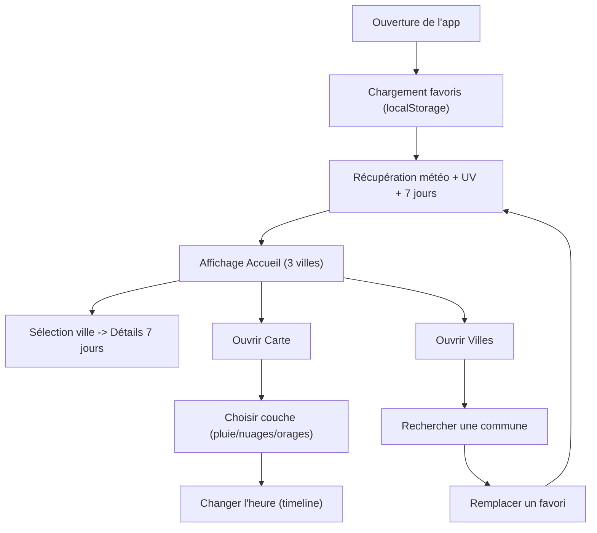

## 1. Vue d’ensemble du produit
Appli web moderne de météo locale avec 3 villes en favoris (06) par défaut, prévisions détaillées 7 jours et carte radar interactive.
- Objectif : consulter rapidement les prévisions, comparer 3 communes, et explorer une carte radar par couches (pluie/nuages/orages).
- Valeur : interface claire, rapide, responsive, orientée “usage quotidien”.

## 2. Fonctionnalités cœur

### 2.1 Rôles utilisateurs
Non applicable (pas d’authentification).

### 2.2 Modules fonctionnels
1. **Tableau météo** : 3 villes favorites, données actuelles + 7 jours, détails (températures, UV, etc.).
2. **Gestion des villes** : recherche, remplacement d’une ville favorite, ajout/suppression, persistance locale.
3. **Carte radar** : carte avec couches sélectionnables (pluie / nuages / orages) et pas de temps horaire.
4. **Préférences** : unités, thème, source de données (si plusieurs fournisseurs), gestion des clés optionnelles.

### 2.3 Détails par page
| Page | Module | Description |
|------|--------|-------------|
| Accueil | Villes favorites | 3 cartes (Saint-Jeannet, Villeneuve-Loubet, Cagnes-sur-Mer) avec résumé “aujourd’hui” + indicateurs clés. |
| Accueil | Prévision 7 jours | Liste 7 jours par ville : min/max, météo (icône), UV max, probabilité précipitations, vent, humidité (selon disponibilité). |
| Accueil | Interaction rapide | Sélection d’une ville pour afficher le détail (panneau latéral ou section dédiée). |
| Villes | Recherche | Champ de recherche + résultats, sélection d’une commune. |
| Villes | Gestion favoris | Remplacer une des 3 villes par une autre, option de réinitialisation aux valeurs par défaut. |
| Carte | Carte interactive | Navigation carte (zoom/déplacement), géolocalisation optionnelle, marqueurs des villes favorites. |
| Carte | Couches & temps | Filtres “Pluie / Nuages / Orages” et sélection du pas horaire (timeline). |
| Réglages | Thème | Mode clair/sombre, densité d’affichage. |
| Réglages | Sources & clés | Choisir la source météo si disponible ; saisir une clé optionnelle (si une couche nécessite une API key). |

## 3. Parcours principaux
1. L’utilisateur ouvre l’appli et voit les 3 villes en favoris avec un résumé météo.
2. Il sélectionne une ville pour consulter la prévision détaillée 7 jours.
3. Il ouvre “Carte” pour visualiser le radar et basculer entre pluie/nuages/orages, en avançant/reculant dans le temps.
4. Il va dans “Villes” pour remplacer une ville favorite via recherche.

## 4. Conception de l’interface
### 4.1 Style visuel
- Direction : moderne, “météo premium”, lisible, avec forte hiérarchie typographique.
- Couleurs : thème sombre par défaut (fond profond), accents lumineux (UV/alertes/CTA) + variantes jour/nuit.
- Typographies : duo “titres expressifs” + “texte très lisible”, chiffres mis en valeur (températures).
- Layout : grilles de cartes, panneaux de détail, navigation haut + barre secondaire (onglets).
- Animations : transitions douces (fade/slide), micro-interactions au survol, timeline fluide sur la carte.

### 4.2 Aperçu UI par page
| Page | Module | Éléments UI |
|------|--------|-------------|
| Accueil | 3 cartes villes | Cartes avec nom + département, température actuelle, icône météo, UV (badge), min/max du jour, CTA “Voir détail”. |
| Accueil | 7 jours | Liste compacte (jour, icône, min/max) + détails au clic (UV, vent, pluie). |
| Carte | Contrôles | Panneau flottant : choix couche, timeline, légende, bouton “centrer sur favoris”. |
| Villes | Recherche | Champ avec suggestions, liste résultats, actions “Remplacer favori 1/2/3”. |

### 4.3 Responsive
- Desktop-first, puis adaptation mobile : cartes empilées, timeline compacte, contrôles carte accessibles au pouce.
